# 🤖 AI 影像識別自動點名系統 (AI Face Recognition Automated Attendance System)

[](https://react.dev/)
[](https://vite.dev/)
[](https://supabase.com/)
[](LICENSE)

本專案為 **AI 影像識別自動點名系統** 的 React 前端管理面板 (Dashboard)。整合了物聯網硬體（Ameba 相機開發板）、邊緣端 AI 臉部識別（YOLOv8 + face_recognition）以及 Supabase 雲端資料庫，實現全自動、無感且即時的智慧點名解決方案。

---

## 🗺️ 系統架構與資料流 (System Architecture)

本系統由**前端控制台**、**雲端資料庫**、與**終端硬體/AI 辨識程式**三大部分組成。架構互動流程如下：

```mermaid
graph TD
    %% 終端硬體與AI辨識部分
    subgraph Edge ["終端硬體與辨識端"]
        A[YOLOv8 臉部偵測 & 特徵提取] -->|擷取 128 維特徵向量| B[人臉識別比對]
        C[Ameba 鏡頭開發板 / 教室相機] -->|影像串流| A
    end

    %% Supabase 部分
    subgraph Cloud ["Supabase 雲端資料庫"]
        D[(students <br> 學生與特徵資料)]
        E[(attendance_sessions <br> 點名課堂批次)]
        F[(attendance_records <br> 簽到點名紀錄)]
    end

    %% 前端平台部分
    subgraph Frontend ["React 前端 Dashboard (本專案)"]
        G[實時儀表板 Dashboard]
        H[人臉錄入與註冊 Students]
        I[系統設定 Settings]
    end

    %% 資料流向
    B -->|HTTP POST JSON| F
    G -->|取得學生與歷史| D & E & F
    H -->|註冊學生 / 拍攝上傳特徵| D
    I -->|儲存 API Key 至 Local / .env| G
    F -->|Realtime WebSocket 訂閱| G
```



---

## ✨ 核心功能 (Key Features)

### 1. 📊 實時點名儀表板 (Dashboard)
* **數據可視化**：以毛玻璃美學 (Glassmorphism) 卡片展示今日出勤率、應到人數、已簽到與缺席人數。
* **即時渲染**：結合 **Supabase Realtime** 功能。當邊緣辨識端（例如執行中的 YOLO 腳本）將新的點名紀錄寫入雲端資料庫時，儀表板會**透過 WebSocket 即時渲染**最新簽到狀態，無需重新整理網頁。

### 2. 📷 本地點名相機與模擬 (Camera & Recognition)
* **相機串流**：可直接開啟本地視訊鏡頭，模擬教室現場點名相機的視訊畫面。
* **人臉框標記**：模擬 YOLOv8 的人臉辨識框，依據辨識置信度在人臉周圍繪製綠色邊框並標示姓名與學號。
* **安全性警告**：若偵測到未註冊的陌生人臉，系統會框選紅色警告標籤，並透過網頁底層 Web Audio API 合成警報提示音。

### 3. 👥 學生管理與 128 維特徵註冊 (Student Registration)
* **特徵值錄入**：支援新增/搜尋/刪除學生，並可在註冊時開啟相機拍攝，由模擬的神經網絡計算出 128 維人臉特徵向量上傳至資料庫。
* **一鍵模擬生成**：提供快速展示模式，可一鍵為學生生成隨機 128 維特徵值，方便在沒有相機的環境下快速測試。

### 4. ⚙️ 展示與實戰雙模式切換 (Settings)
* **展示模擬模式 (Offline/Mock)**：無須任何資料庫配置。所有學生與點名資料均儲存於瀏覽器的 `LocalStorage` 中，適合離線演示或快速功能點檢。
* **Supabase 連線模式 (Production)**：連結雲端資料庫，支援安全防護（RLS 規則）與 Realtime 即時推播。內建連線診斷工具，若連線失敗會給予精確的繁體中文引導（例如檢查金鑰或 SQL 結構）。

---

## 🛠️ 技術棧 (Tech Stack)

* **前端框架**：[React 19.2](https://react.dev/) + [Vite 8.0](https://vite.dev/) (極速熱重載與打包)
* **雲端後端**：[Supabase](https://supabase.com/) (PostgreSQL + PostgREST API + WebSockets Realtime)
* **視覺圖示**：[Lucide React](https://lucide.dev/) (現代簡約圖示)
* **介面設計**：客製化 Vanilla CSS (包含毛玻璃特效、CSS 變數主題色彩、微動畫與自適應響應式排版)

---

## 🗄️ 資料庫結構 (Database Schema)

本專案的 PostgreSQL 資料表定義檔案位於 [supabase/schema.sql](supabase/schema.sql)。結構包含三個核心資料表：

```sql
-- 1. 學生資料表 (Students)
CREATE TABLE students (
    id UUID PRIMARY KEY DEFAULT gen_random_uuid(),
    student_number VARCHAR(50) UNIQUE NOT NULL,      -- 學號 (有索引)
    name VARCHAR(100) NOT NULL,                      -- 姓名
    avatar_url TEXT,                                 -- 頭像 (Base64 或 網址)
    face_features JSONB,                             -- 128 維人臉特徵向量 (JSON)
    created_at TIMESTAMP WITH TIME ZONE DEFAULT NOW()
);

-- 2. 點名批次/課程課堂表 (Attendance Sessions)
CREATE TABLE attendance_sessions (
    id UUID PRIMARY KEY DEFAULT gen_random_uuid(),
    class_name VARCHAR(150) NOT NULL,                -- 課堂/活動名稱
    session_date DATE DEFAULT CURRENT_DATE NOT NULL, -- 點名日期
    status VARCHAR(20) DEFAULT 'active' NOT NULL,    -- 狀態 ('active' | 'completed')
    created_at TIMESTAMP WITH TIME ZONE DEFAULT NOW()
);

-- 3. 點名紀錄表 (Attendance Records)
CREATE TABLE attendance_records (
    id UUID PRIMARY KEY DEFAULT gen_random_uuid(),
    session_id UUID REFERENCES attendance_sessions(id) ON DELETE CASCADE,
    student_id UUID REFERENCES students(id) ON DELETE CASCADE,
    check_in_time TIMESTAMP WITH TIME ZONE DEFAULT NOW(),
    status VARCHAR(20) DEFAULT 'present' NOT NULL,   -- 狀態 ('present' | 'late' | 'absent')
    confidence DOUBLE PRECISION DEFAULT 1.0,         -- AI 辨識置信度 (0.0 ~ 1.0)
    photo_url TEXT,                                  -- 簽到快照連結
    created_at TIMESTAMP WITH TIME ZONE DEFAULT NOW(),
    UNIQUE (session_id, student_id)                  -- 單一課堂中學生不會重複簽到
);
```

---

## 🚀 快速開始 (Getting Started)

### 1. 安裝與執行

請在 `frontend` 子目錄下執行以下指令：

```bash
# 安裝相依套件
npm install

# 運行本地開發伺服器
npm run dev
```
瀏覽器將會開啟 `http://localhost:5173`。

### 2. 配置環境變數 (選填，用於開發環境連線)

為了避免每次重新開啟網頁都需要手動在 UI 中設定 API 金鑰，您可以在 `frontend/` 目錄下建立一個 `.env` 檔案，Vite 會自動讀取並進行連線設定：

```env
VITE_SUPABASE_URL=https://your-supabase-project.supabase.co
VITE_SUPABASE_ANON_KEY=your-supabase-anon-key
```

---

## 📡 邊緣端/AI 辨識端 API 連接說明

邊緣端的 AI 點名程式（例如執行 [yolo_attendance.py](../ai/yolo_attendance.py) 的電腦）會在識別成功後，對 Supabase 的 RESTful API 發送 HTTPS POST 請求：

### 📡 請求端點 (POST Endpoint)
```http
POST https://<YOUR_SUPABASE_PROJECT_ID>.supabase.co/rest/v1/attendance_records
```

### 🔑 請求標頭 (Headers)
```http
apikey: <YOUR_SUPABASE_ANON_KEY>
Authorization: Bearer <YOUR_SUPABASE_ANON_KEY>
Content-Type: application/json
Prefer: return=representation
```

### 📄 請求內文 (JSON Body)
```json
{
  "session_id": "00000000-0000-0000-0000-000000000000",
  "student_id": "11111111-1111-1111-1111-111111111111",
  "confidence": 0.96,
  "status": "present"
}
```

---

## 📂 檔案目錄結構 (Directory Structure)

```text
frontend/
├── public/                 # 靜態資源
├── src/
│   ├── assets/             # 圖片、Logo 等靜態資源
│   ├── components/         # 拆分後的功能性元件
│   │   ├── ApiCodeBlock.jsx    # API 程式碼區塊展示元件
│   │   ├── CameraTab.jsx       # 點名相機與 YOLO 模擬元件
│   │   ├── DashboardTab.jsx    # 數據儀表板統計元件
│   │   ├── Header.jsx          # 頁面頂部導覽列
│   │   ├── HistoryTab.jsx      # 點名日誌紀錄元件
│   │   ├── SettingsTab.jsx     # 連線與模式設定元件
│   │   ├── Sidebar.jsx         # 側邊選單導覽列
│   │   └── StudentsTab.jsx      # 學生名冊與人臉錄入元件
│   ├── App.css             # 全域/元件微調樣式
│   ├── App.jsx             # 應用程式主邏輯與分頁控制
│   ├── index.css           # 系統設計風格系統與 UI Token 樣式
│   ├── main.jsx            # React 進入點
│   └── supabaseClient.js   # Supabase Client 初始化配置
├── supabase/
│   └── schema.sql          # 資料庫資料表與 RLS 權限配置檔
├── index.html              # HTML5 進入模板
├── package.json            # 套件定義與腳本配置
└── vite.config.js          # Vite 建置配置設定
```

---

## 📄 授權條款 (License)

本專案採用 **CC0 1.0 Universal (公有領域 / Public Domain)** 授權條款 - 詳情請參閱 [LICENSE](LICENSE) 檔案。