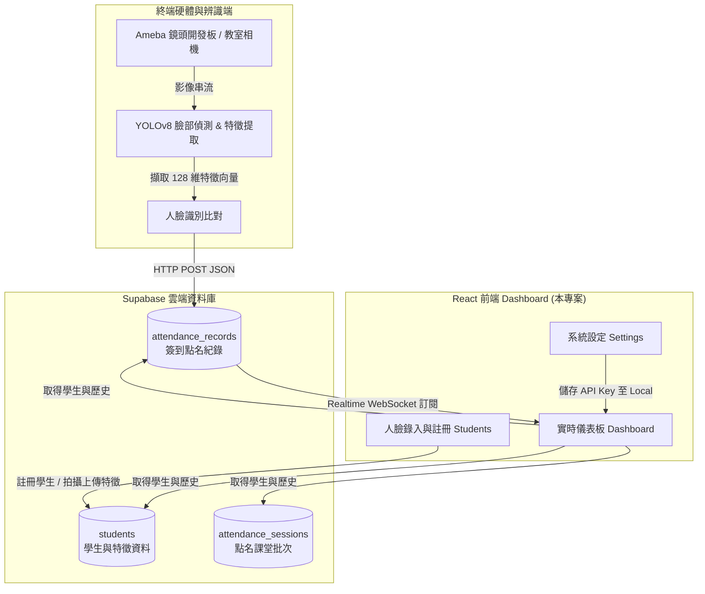

# 🤖 AI 影像識別自動點名系統 (AI Face Recognition Automated Attendance System)

[](https://react.dev/)
[](https://vite.dev/)
[](https://supabase.com/)
[](LICENSE)

本專案為 **AI 影像識別自動點名系統** 的 React 前端管理面板 (Dashboard)。結合了進階的 AI 人臉識別、物聯網硬體（Ameba 開發板與相機）與 Supabase 雲端資料庫，實現全自動、無感且即時的課堂/會議點名解決方案。

---

## 🗺️ 系統架構圖 (System Architecture)

本系統由**前端控制台**、**雲端資料庫**、與**終端硬體/AI 識別程式**三大部分組成。架構互動流程如下：



---

## ✨ 核心功能 (Key Features)

### 1. 📊 實時點名儀表板 (Dashboard)
- **數據可視化**：以毛玻璃美學 (Glassmorphism) 卡片展示今日出勤率、應到人數、已簽到與缺席人數。
- **動態更新**：結合 Supabase Realtime 機制，當硬體端或 YOLO 辨識上傳簽到紀錄時，儀表板將**不發送重新整理請求**即時渲染最新簽到狀態。

### 2. 📷 點名相機與模擬 (Camera & Recognition)
- **相機串流**：開啟本地相機，模擬教室點名相機的視訊畫面。
- **辨識框渲染**：模擬 YOLOv8 運作，自動在畫面中框選偵測到的人臉，並依據置信度 (Confidence) 顯示學生姓名。
- **安全防範**：若偵測到未登錄人臉，系統會發出紅色邊框警報，並透過 Web Audio API 發送警報提示音。

### 3. 👥 學生管理與 128 維特徵錄入 (Student Registration)
- **名單管理**：支援即時搜尋學號與姓名、查詢特徵錄入狀態，並提供刪除功能。
- **AI 特徵錄入**：
  - **相機擷取模式**：在實戰連線模式下，可啟動鏡頭直接拍攝學生人臉，由模擬的神經網絡 (ResNet-128) 進行特徵計算，生成 128 維人臉特徵向量上傳資料庫。
  - **模擬生成模式**：在展示狀態下，可一鍵隨機生成特徵向量，加速系統功能演示。

### 4. 📜 點名歷史紀錄 (Attendance History)
- 詳細記錄學生簽到時間、出勤狀態（已到、遲到、缺席）與 AI 辨識置信度。
- 提供一鍵清除與重設資料功能。

### 5. ⚙️ 展示與實戰雙模式切換 (Settings)
- **展示模擬模式**：完全不需要配置資料庫。所有學生與點名資料均儲存在本地 `LocalStorage` 緩存中，適合離線演示或快速體驗。
- **Supabase 連線模式**：直接串接雲端 PostgreSQL 資料庫，支援 RLS (Row Level Security) 與 Realtime 即時推播。
- **自動故障排除**：內建 Supabase 連線診斷器，若連線失敗會自動偵測是「網路錯誤」、「API Key 錯誤」或是「SQL 結構未導入」，並給予精準的繁體中文修復建議。

---

## 🛠️ 技術棧 (Tech Stack)

- **前端核心**：[React 19](https://react.dev/) + [Vite](https://vite.dev/) (高效編譯與模組熱替換)
- **雲端資料庫**：[Supabase](https://supabase.com/) (PostgreSQL + PostgREST + WebSockets)
- **圖示庫**：[Lucide React](https://lucide.dev/) (現代簡約線條圖標)
- **介面設計**：客製化 Vanilla CSS (整合毛玻璃玻璃質感、CSS 變數主題系統、流暢的微動畫效果與自適應響應式佈局)
- **提示音效**：Web Audio API (純瀏覽器底層音訊合成，免載入大型 MP3 檔)

---

## 🗄️ 資料庫結構 (Database Schema)

本專案搭配 Supabase (PostgreSQL) 使用。資料表結構定義於 [/supabase/schema.sql](https://github.com/FocalZoe/attendance-frontend/blob/main/supabase/schema.sql) 中，包含三個核心資料表：

```sql
-- 1. 學生基本與特徵資料表
CREATE TABLE students (
    id UUID PRIMARY KEY DEFAULT gen_random_uuid(),
    student_number VARCHAR(50) UNIQUE NOT NULL,      -- 學號 (建立索引)
    name VARCHAR(100) NOT NULL,                      -- 姓名
    avatar_url TEXT,                                 -- 頭像 (Base64 或 網址)
    face_features JSONB,                             -- 128 維人臉特徵向量 (JSON)
    created_at TIMESTAMP WITH TIME ZONE DEFAULT NOW()
);

-- 2. 課程/點名批次表
CREATE TABLE attendance_sessions (
    id UUID PRIMARY KEY DEFAULT gen_random_uuid(),
    class_name VARCHAR(150) NOT NULL,                -- 課堂/活動名稱
    session_date DATE DEFAULT CURRENT_DATE NOT NULL, -- 點名日期
    status VARCHAR(20) DEFAULT 'active' NOT NULL,    -- 狀態 ('active' | 'completed')
    created_at TIMESTAMP WITH TIME ZONE DEFAULT NOW()
);

-- 3. 學生點名紀錄表
CREATE TABLE attendance_records (
    id UUID PRIMARY KEY DEFAULT gen_random_uuid(),
    session_id UUID REFERENCES attendance_sessions(id) ON DELETE CASCADE,
    student_id UUID REFERENCES students(id) ON DELETE CASCADE,
    check_in_time TIMESTAMP WITH TIME ZONE DEFAULT NOW(),
    status VARCHAR(20) DEFAULT 'present' NOT NULL,   -- 出勤狀態 ('present' | 'late' | 'absent')
    confidence DOUBLE PRECISION DEFAULT 1.0,         -- AI 置信度 (0.0 ~ 1.0)
    photo_url TEXT,                                  -- 當下快照 URL
    created_at TIMESTAMP WITH TIME ZONE DEFAULT NOW(),
    UNIQUE (session_id, student_id)                  -- 單一課堂不可重複點名
);
```

---

## 🚀 快速開始 (Getting Started)

### 步驟 1：複製並進入專案目錄
```bash
git clone https://github.com/FocalZoe/attendance-frontend.git
cd attendance-frontend
```
> *(備註：若您是在本地整合專案中，請確保 `cd` 進到 `frontend` 子資料夾。)*

### 步驟 2：安裝相依套件
```bash
npm install
```

### 步驟 3：運行本地開發伺服器
```bash
npm run dev
```
瀏覽器將自動開啟或提示存取 `http://localhost:5173`。

---

## 🔌 雲端 Supabase 串接指引

若要將系統從「展示模擬模式」切換至「Supabase 連線模式」，請按照下列步驟操作：

1. **建立 Supabase 專案**：登入 [Supabase 平台](https://supabase.com/) 新增專案。
2. **執行 SQL 初始化**：進入 Supabase 後台的 **SQL Editor**，複製專案中 [/supabase/schema.sql](https://github.com/FocalZoe/attendance-frontend/blob/main/supabase/schema.sql) 的內容並點擊 **Run**。
3. **開啟即時監聽 (Realtime)**：
   - 前往 Supabase 後台 -> **Database** -> **Replication**。
   - 在 `Source` 中編輯表格，啟用 `attendance_records` 資料表的 Realtime 廣播權限。
4. **填寫連線金鑰**：
   - 在網頁前端點選左下角的 **設定 (Settings)**。
   - 將運作模式切換為 **「Supabase 連線模式」**。
   - 貼上您專案的 `Project URL` 與 `Anon Key`（可於 Supabase 後台 Project Settings -> API 取得）。
   - 點擊 **儲存設定**。若顯示綠色「已成功連接雲端資料庫」標誌即表示設定成功！

---

## 📡 硬體/AI 識別端上傳介面 (API Integration for Hardware/Python)

Supabase 基於 PostgreSQL 會自動生成對應的 RESTful API。您的硬體端（如 Ameba 開發板）或 Python 辨識程式（如 YOLO 點名腳本）只需要對資料庫發送標準的 **HTTPS POST** 請求。

### 📡 請求端點
```http
POST https://<YOUR_SUPABASE_PROJECT_ID>.supabase.co/rest/v1/attendance_records
```

### 🔑 請求標頭 (Headers)
```http
apikey: <YOUR_SUPABASE_ANON_KEY>
Authorization: Bearer <YOUR_SUPABASE_ANON_KEY>
Content-Type: application/json
Prefer: return=representation
```

### 📄 請求內文 (JSON Body)
```json
{
  "session_id": "00000000-0000-0000-0000-000000000000",
  "student_id": "11111111-1111-1111-1111-111111111111",
  "confidence": 0.96,
  "status": "present"
}
```

---

## 📂 檔案目錄結構 (Directory Structure)

```text
frontend/
├── public/                 # 靜態資源
├── src/
│   ├── assets/             # 圖片、Logo 等靜態資源
│   ├── components/         # 拆分後的功能性元件
│   │   ├── ApiCodeBlock.jsx    # API 程式碼區塊展示元件
│   │   ├── CameraTab.jsx       # 點名相機與 YOLO 模擬元件
│   │   ├── DashboardTab.jsx    # 數據儀表板統計元件
│   │   ├── Header.jsx          # 頁面頂部導覽列
│   │   ├── HistoryTab.jsx      # 點名日誌紀錄元件
│   │   ├── SettingsTab.jsx     # 連線與模式設定元件
│   │   ├── Sidebar.jsx         # 側邊選單導覽列
│   │   └── StudentsTab.jsx      # 學生名冊與人臉錄入元件
│   ├── App.css             # 全域/元件微調樣式
│   ├── App.jsx             # 應用程式主邏輯與分頁控制
│   ├── index.css           # 系統設計風格系統與 UI Token 樣式
│   ├── main.jsx            # React 進入點
│   └── supabaseClient.js   # Supabase Client 初始化配置
├── supabase/
│   └── schema.sql          # 資料庫資料表與 RLS 權限配置檔
├── index.html              # HTML5 進入模板
├── package.json            # 套件定義與腳本配置
└── vite.config.js          # Vite 建置配置設定
```

---

## 📄 授權條款 (License)

本專案採用 **CC0 1.0 Universal (公有領域 / Public Domain)** 授權條款 - 詳情請參閱 [LICENSE](https://github.com/FocalZoe/attendance-frontend/blob/main/LICENSE) 檔案。